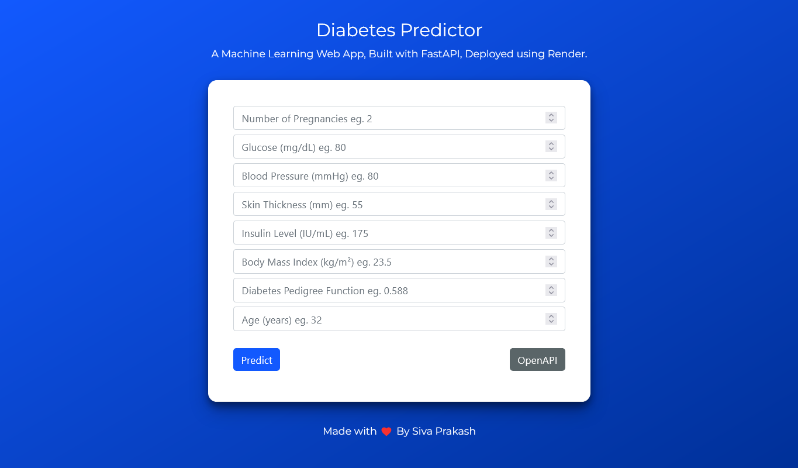

# Diabetes Predictor


Diabetes Predictor App used to predict whether a person has diabetes or not based on certain input parameters created using python's scikit-learn, fastapi, numpy and joblib packages.

## Dataset Description

The datasets consist of several medical predictor (independent) variables and one target (dependent) variable, Outcome. Independent variables include the number of pregnancies the patient has had, their BMI, insulin level, age, and so on.

The data contains the following columns:

| Feature Name               | Feature Description                                                                                 |
| -------------------------- | --------------------------------------------------------------------------------------------------- |
| Pregnancies                | Number of times pregnant                                                                            |
| Glucose                    | Plasma glucose concentration a 2 hours in an oral glucose tolerance test                            |
| BloodPressure              | Diastolic blood pressure (mm Hg)                                                                    |
| SkinThickness              | Triceps skin fold thickness (mm)                                                                    |
| Insulin                    | 2-Hour serum insulin (mu U/ml)                                                                      |
| BMI                        | Body mass index (weight in kg/(height in m)^2)                                                      |
| Diabetes pedigree function | Diabetes pedigree function (a function which scores likelihood of diabetes based on family history) |
| Age                        | Age (years)                                                                                         |
| Outcome                    | Class variable (0 or 1) 268 of 768 are 1, the others are 0                                          |

## Installation

Open Anaconda prompt and create new environment

```
conda create -n your_env_name python = (any_version_number)
```

Then Activate the newly created environment

```
conda activate your_env_name
```

Clone the repository using `git`

```
git clone https://github.com/Prakashdeveloper03/Diabetes-Predictor.git
```

Change to the cloned directory

```
cd <directory_name>
```

To install all requirement packages for the app

```
pip install -r requirements.txt
```

Then, Run the app

```
uvicorn main:app --reload
```

## 📷 Screenshots

### Home page



### Swagger UI


### Redoc UI


### Demo GIF


